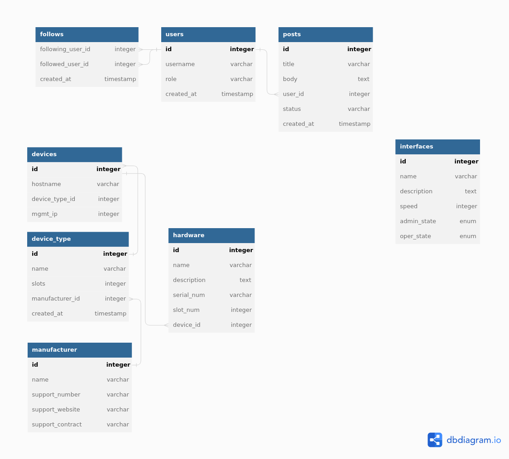

# Work Notes

## Juniper

### MPLS
* Good trouble shooting commands and explanation of CSPF that RSVP uses
    [RSVP Overview](https://www.juniper.net/documentation/us/en/software/junos/mpls/topics/topic-map/rsvp-overview.html)

## Projects and Ideas
* network mapping with leaflet and arangodb
    * pull data from network with rpc calls(juniper)
        * data: ip interfaces, device inventory, lsp's and coloring
    * insert devices and interfaces into arangodb
    * iterate over L3 interfaces and connect them using subnets
        * IP addresses will have to be integers select all records between network and broadcast addresses

* ARIN Work
    * pull data from ARIN
        * what are we advertising to who?
        * Moving IPs into 1 container

